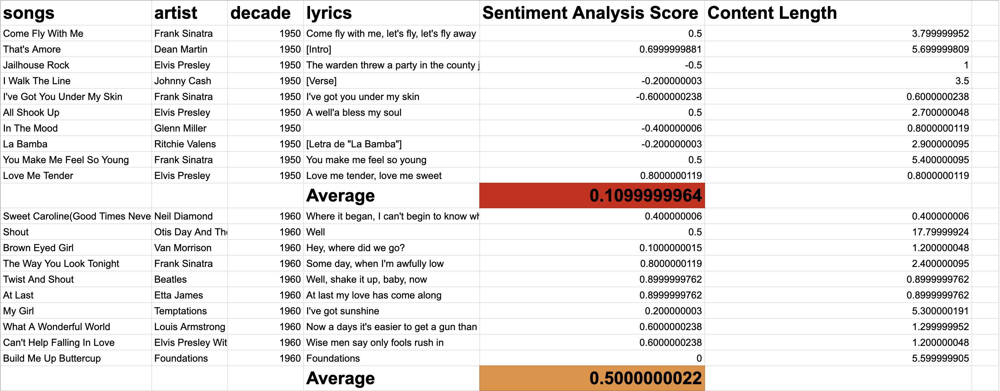

# Sentiment Analysis Of Songs From Across the recent decades

I performed sentiment analysis across songs from different decades to see trends in the types of songs that were produced. I am no NLP guru and I realize that this approach is not the most effective to extract the sentiment from the lyrics as lyrics have repeat words and the data trained for Google Cloud's Natural Language API was probably trained on real text. That said, I pursued this project for fun and I hope you enjoy it :) 

# Things I learned

- Utilizing Google Colab Notebooks
- Using Google Cloud API's to accomplish Sentiment Analysis Of Text by using Google Cloud Natural Language Api
- Using Pandas to import, export and manage data. 
- Using API's sourced from Rapid API and extracting data using JSON

### Final CSV file outline average sentiment of each decade 
> You may also view this file on this link [here](https://rofaze21.github.io/demonstrations-web/DemoOne.md). 

